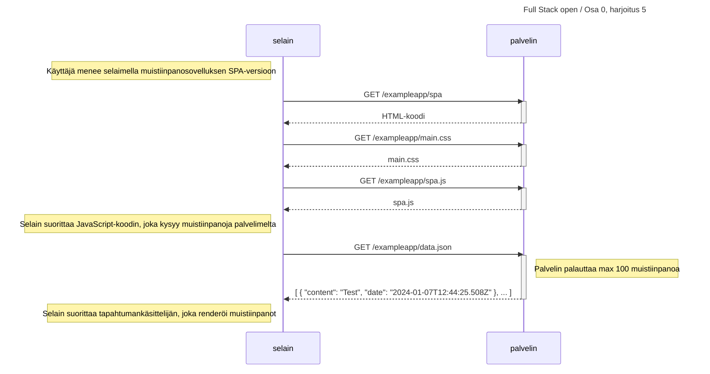

```mermaid
sequenceDiagram
    title Full Stack open / Osa 0, harjoitus 5

    participant selain
    participant palvelin

    note left of selain: Käyttäjä menee selaimella muistiinpanosovelluksen SPA-versioon

    selain->>palvelin: GET /exampleapp/spa
    activate palvelin
    palvelin-->>selain: HTML-koodi
    deactivate palvelin

    selain->>palvelin: GET /exampleapp/main.css
    activate palvelin
    palvelin-->>selain: main.css
    deactivate palvelin

    selain->>palvelin: GET /exampleapp/spa.js
    activate palvelin
    palvelin-->>selain: spa.js
    deactivate palvelin

    note left of selain: Selain suorittaa JavaScript-koodin, joka kysyy muistiinpanoja palvelimelta

    selain->>palvelin: GET /exampleapp/data.json
    activate palvelin
    note right of palvelin: Palvelin palauttaa max 100 muistiinpanoa
    palvelin-->>selain: [ { "content": "Test", "date": "2024-01-07T12:44:25.508Z" }, ... ]
    deactivate palvelin

    note left of selain: Selain suorittaa tapahtumankäsittelijän, joka renderöi muistiinpanot
```