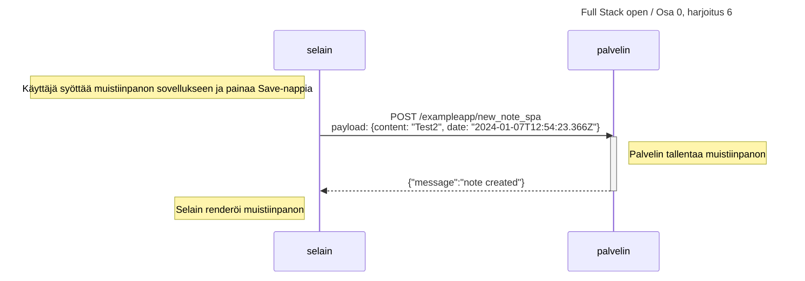

```mermaid
sequenceDiagram
    title Full Stack open / Osa 0, harjoitus 6

    participant selain
    participant palvelin

    note left of selain: Käyttäjä syöttää muistiinpanon sovellukseen ja painaa Save-nappia

    selain->>palvelin: POST /exampleapp/new_note_spa<br>payload: {content: "Test2", date: "2024-01-07T12:54:23.366Z"}
    activate palvelin
    note right of palvelin: Palvelin tallentaa muistiinpanon
    palvelin-->>selain: {"message":"note created"}
    deactivate palvelin

    note left of selain: Selain renderöi muistiinpanon
```